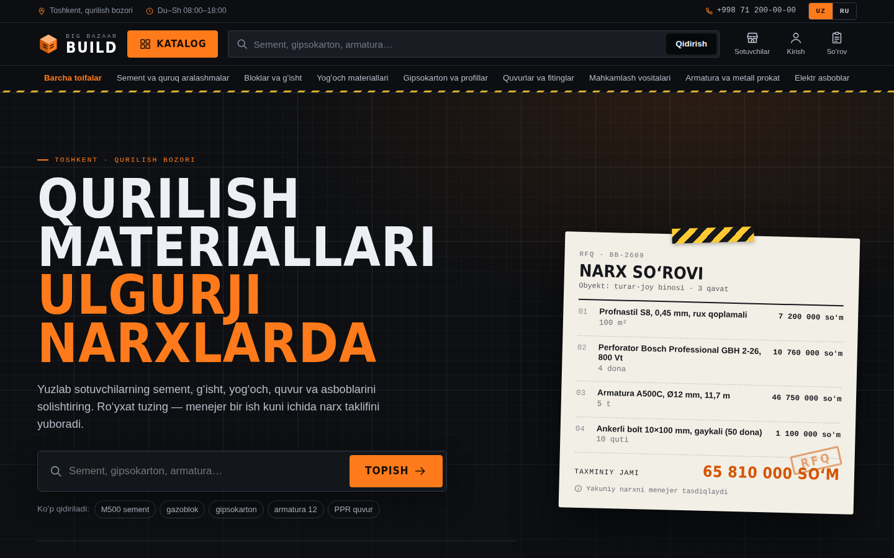
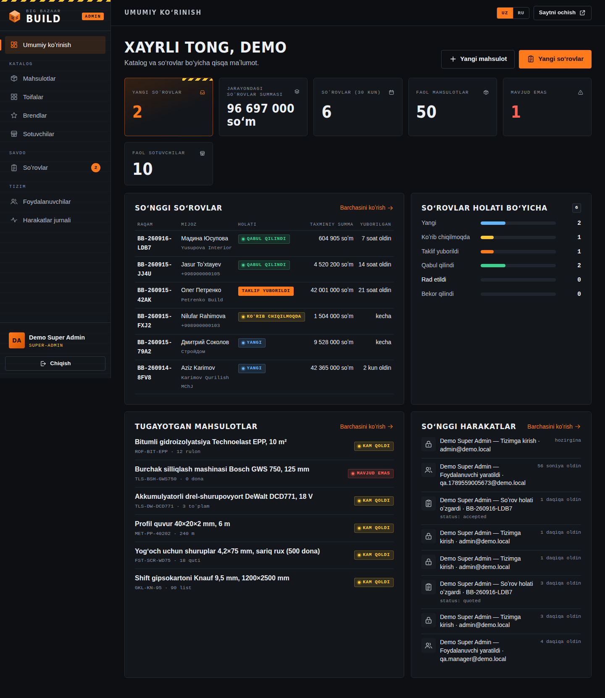
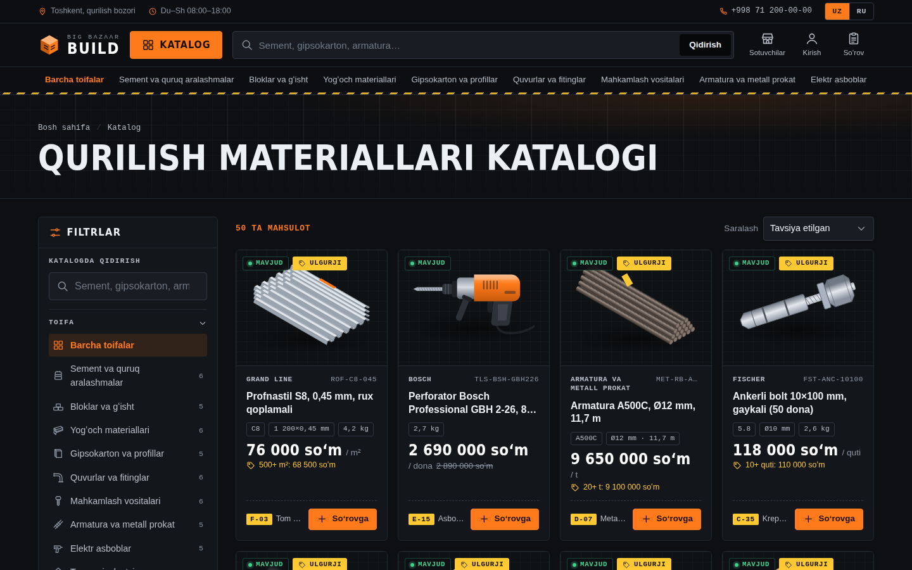
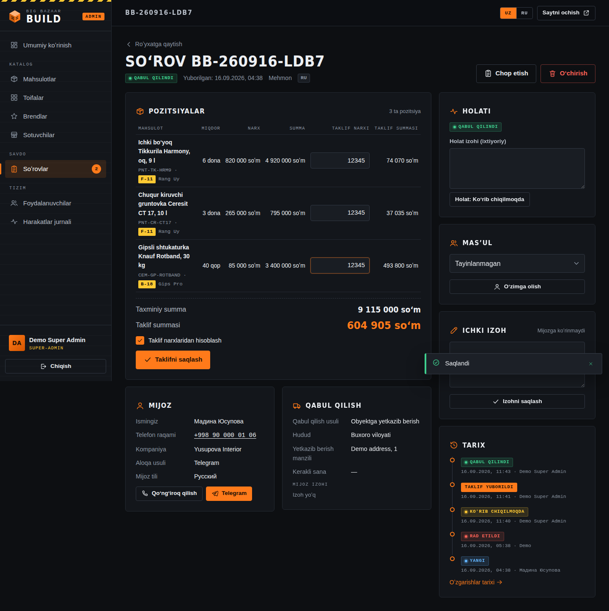
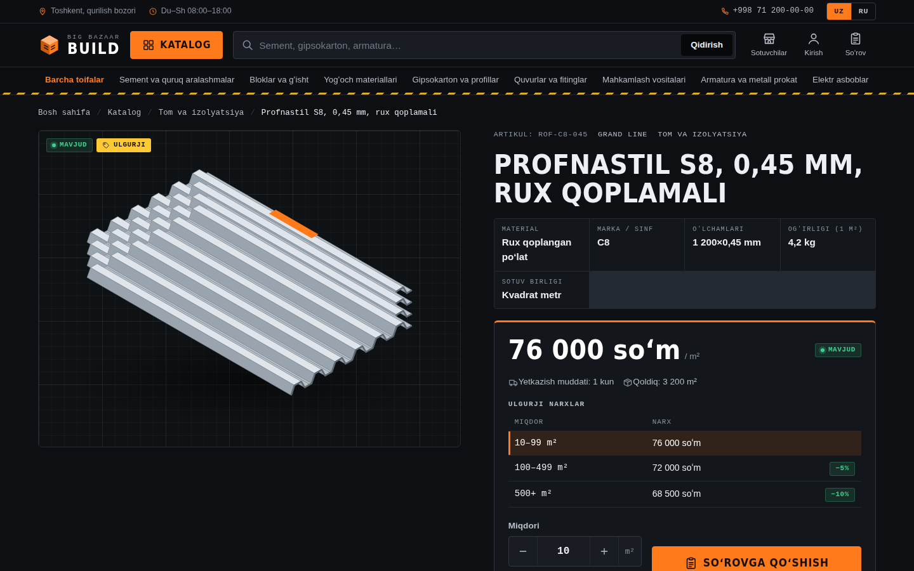
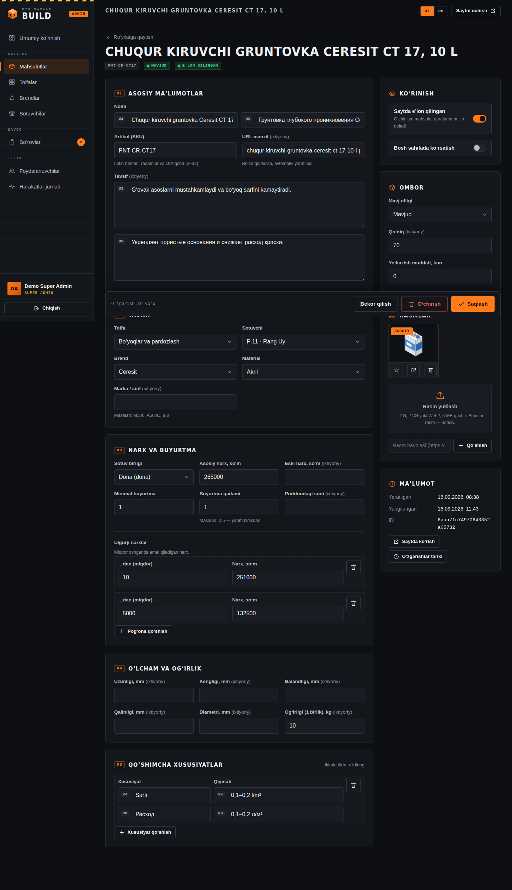
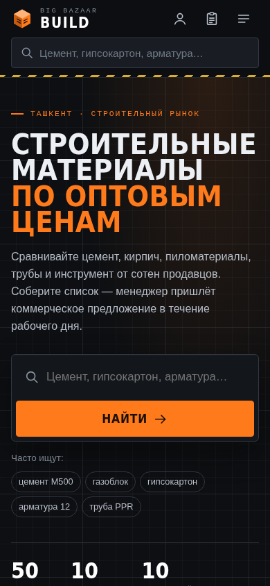
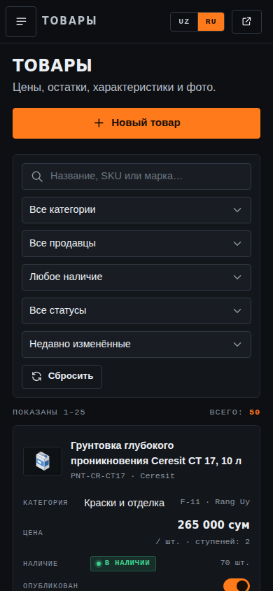

# Big Bazaar Build

A construction-materials marketplace for a Tashkent building bazaar: a bilingual catalog
(**Uzbek Latin** by default, **Russian** on the header toggle), a quote-request cart ("narx
so'rovi") instead of online payment, and a hardened back-office for super-admins and managers.

Built with **Node.js + Express + MongoDB (Mongoose)** and **vanilla ES modules**. There is no
build step and there are only three runtime dependencies (`express`, `mongoose`, `dotenv`).

| Storefront | Admin panel |
| --- | --- |
|  |  |
|  |  |
|  |  |
|  |  |

---

## Contents

1. [Quick start](#quick-start)
2. [Scripts](#scripts)
3. [Project layout](#project-layout)
4. [Features](#features)
5. [Security model](#security-model)
6. [Roles and permissions](#roles-and-permissions)
7. [Internationalisation](#internationalisation)
8. [Catalog data model](#catalog-data-model)
9. [API overview](#api-overview)
10. [Configuration](#configuration)
11. [Production checklist](#production-checklist)
12. [Migrating from the tech-shop version](#migrating-from-the-tech-shop-version)

---

## Quick start

### Option A: offline demo (no MongoDB needed)

```bash
npm install
npm run demo
```

The demo starts a small bundled in-memory MongoDB-compatible server (`tools/mini-mongo`). It
seeds 10 categories, 16 brands, 10 bazaar suppliers, 50 products and sample quote requests. It
also creates two accounts and prints their one-time passwords in the terminal:

| Account | Role |
| --- | --- |
| `admin@demo.local` | Super-admin |
| `manager@demo.local` | Manager |

Open <http://localhost:5000> for the site and <http://localhost:5000/admin> for the admin panel.
All data is lost when the process stops. **The demo is not for production.**

### Option B: real MongoDB

Requirements: Node.js 22+ and MongoDB 6+ (a replica set is not required).

```bash
npm install
npm run setup                 # creates .env with a random APP_SECRET
# edit .env → MONGODB_URI, APP_ORIGIN, SUPPORT_PHONE …
npm run seed                  # demo catalog (only if the catalog is empty)
npm run create-admin          # interactive: first super-admin
npm start
```

With Docker:

```bash
cp .env.example .env && npm run setup   # or set APP_SECRET yourself
docker compose up --build
docker compose exec app npm run seed
docker compose exec app npm run create-admin
```

## Scripts

| Command | Purpose |
| --- | --- |
| `npm start` | Start the server (`server.js`) |
| `npm run dev` | Start with auto-restart when `src/` changes |
| `npm run demo` | Offline demo with in-memory data |
| `npm run setup` | Create `.env` from `.env.example` with a fresh `APP_SECRET` |
| `npm run seed` | Seed the catalog. Flags: `-- --reset` (replace catalog and quotes), `-- --demo-quotes` |
| `npm run create-admin` | Create or reset a super-admin (interactive, or via `ADMIN_EMAIL`/`ADMIN_NAME`/`ADMIN_PASSWORD`) |
| `npm test` | 51 integration and unit tests (`node:test`, in-memory database) |
| `npm run check:i18n` | Fail if the uz/ru dictionaries have different keys |
| `npm run lint` | ESLint (flat config, no plugins required) |
| `npm run check` | Lint, then the i18n check, then the tests |
| `npm run generate:illustrations` | Regenerate the isometric product SVGs in `public/img/catalog` |

## Project layout

```
server.js                 entry point (config → logger → DB → HTTP, graceful shutdown)
src/
  app.js                  Express app factory (middleware order lives here)
  config.js               validated env config; refuses unsafe production settings
  domain/constants.js     units, materials, stock statuses, quote workflow, regions …
  security/               sessions, CSRF, rate limits, RBAC, password hashing, headers, cookies
  middleware/             auth guards, locale, request id/logging, error handler
  models/                 User, Session, AuditLog, RateLimitHit, Category, Brand, Supplier, Product, QuoteRequest
  services/               catalog, admin catalog, quotes, users, auth, audit, uploads, Telegram notify
  validation/             request schemas (custom dependency-free validator in lib/schema.js)
  routes/api/             /api/auth, /api/catalog, /api/quotes, /api/account, /api/admin
  routes/pages.js         server-rendered pages (SEO titles, hreflang, JSON-LD)
  views/                  tiny template engine + layouts, partials and pages
  i18n/                   dictionaries (uz.json, ru.json) and helpers
  seed/                   demo catalog
public/
  css/app.css             storefront design system (industrial dark theme)
  css/admin.css           back-office shell, tables and editors
  js/site.js              storefront entry → js/pages/*
  js/admin/app.js         admin SPA entry → js/admin/views/*
  js/lib/                 shared browser modules (safe HTML, API client, i18n, forms, UI)
  img/catalog/            generated product illustrations
scripts/                  demo, setup, seed, create-admin
tools/                    mini-mongo (tests/demo), illustration generator
test/                     node:test suites
```

## Features

### Storefront

- **Home page:** hero search, live counters, category tiles, featured products and suppliers,
  and a "spec sheet" quote teaser.
- **Catalog:**
  - Full-text search in both languages. Search ignores Uzbek apostrophes (ʻ ʼ ') and treats ё as е.
  - Faceted filters: category, brand, material, grade, availability, unit, supplier, thickness and diameter, price range, and bulk-pricing only.
  - Live facet counts and filter chips; the filter state is kept in the URL.
  - Sorting and pagination.
  - On mobile, the filters open in an off-canvas drawer.
- **Product page:**
  - Gallery and key specs (dimensions, weight, grade, units per pallet).
  - Bulk-price tier table and a quantity stepper that respects the minimum order and step size.
  - Live cost estimate, supplier card with call / Telegram / WhatsApp buttons, and similar products.
  - Sticky buy bar on mobile.
- **Quote cart (RFQ):**
  - The cart is stored locally in the browser; the server recomputes every price.
  - Three-step flow; delivery or pickup, region, date and preferred contact channel.
  - Honeypot and rate limiting against spam.
  - A confirmation number is shown, and an optional Telegram notification goes to managers.
- **Customer accounts:** registration with the password policy and a strength meter, quote history with quoted prices, profile, password change, and "log out everywhere".
- **Suppliers:** directory of bazaar suppliers (stall number, hours, payment, delivery) and a page per supplier.
- **SEO and accessibility:**
  - Server-rendered titles and descriptions in the current language, plus `hreflang` alternates and Product JSON-LD.
  - Skip links, keyboard support, ARIA live regions and `prefers-reduced-motion`.

### Admin panel (`/admin`)

- **Dashboard:** KPIs (new quotes, pipeline value, 30-day volume, active and out-of-stock products, suppliers), recent quotes, quotes by status, low stock, and recent activity.
- **Products:**
  - Filterable, paginated table with an inline publish switch and actions to duplicate, feature, view on site, show history and delete.
  - Full editor with bilingual name and description, classification, unit, price, old price, minimum order, step, units per pallet, bulk-price tiers, dimensions, weight, and bilingual specs.
  - Stock status, quantity and lead time.
  - Images: drag-and-drop upload, image by URL, cover selection.
  - Unsaved-changes guard.
- **Categories, brands and suppliers:** list and slide-over editors. Items still used by products cannot be deleted.
- **Quote requests:**
  - Filter by status or assignee.
  - Detail page with per-line quoted prices, an automatic or manual quoted total, and status transitions that follow the workflow (with notes).
  - Assignment, internal notes, full history, one-click call / Telegram / WhatsApp, and a print view.
- **Users (super-admin only):**
  - Create staff or customer accounts with a generated one-time password; the user must change it at first login.
  - Change role, activate or deactivate, reset password, unlock, end sessions, delete.
- **Activity log (super-admin only):** filter by user, action, object, result and date range. Each entry expands to show a field-level before/after diff, metadata, IP, device and request id.
- **My account:** profile, password change, and the list of active sessions with the option to end any of them.
- **Session protection:** warns before the idle timeout and returns to the login page with the current view remembered.
- **Layout:** responsive, with an off-canvas sidebar on small screens and tables that turn into cards.

## Security model

| Threat | Mitigation |
| --- | --- |
| Session theft / fixation | Server-side sessions. The cookie holds a 256-bit random token and only its SHA-256 hash is stored. Cookies are `HttpOnly`, `SameSite=Strict` for staff, `Lax` for customers, and `Secure` plus `__Host-` prefix on HTTPS. A new session is created at login. Idle timeouts (staff 30 min, customers 14 days) and absolute timeouts (12 h / 30 days) apply. `tokenVersion` revokes every session after a password, role or status change. |
| CSRF | HMAC-signed double-submit token bound to the session, sent in the `X-CSRF-Token` header and rotated at login and logout. `Origin` and `Sec-Fetch-Site` checks. SameSite cookies. |
| Brute force | Per-IP limits (admin login: 10 per 15 min; site login: 30), a per-email limit and account lockout after 5 failures (15 min, doubling on repeats). Unknown emails get identical responses with equalised timing. The rate-limit store is shared through MongoDB for multi-instance deployments. |
| Weak passwords | At least 12 characters with upper case, lower case, digit and symbol. Blocks common passwords, keyboard sequences, site words and the user's own name or email. The last 5 passwords cannot be reused. Hashing uses scrypt (N=2¹⁵, r=8, p=3) with transparent rehashing. Temporary passwords force a change before any admin API call. |
| XSS | All text input is cleaned (tags, control and bidi characters removed). All client rendering goes through an escaping `html` template and a single Trusted Types sink. Strict CSP: `script-src 'self'`, no inline scripts or styles, `require-trusted-types-for 'script'`. URLs are checked with `safeUrl`. JSON is embedded safely. |
| NoSQL / SQL injection | Every request body, query and params object is validated against a schema that builds a new object containing only declared fields. Keys starting with `$`, containing `.` or matching `__proto__` are rejected. Mongoose runs with `sanitizeFilter` and `strictQuery`. Operators are only added server-side via `mongoose.trusted()`. Regex input is escaped. Express uses the `simple` query parser. |
| Mass assignment / privilege escalation | Schemas strip unknown fields, so `role` cannot be sent at registration. Admins cannot change their own role or status, and the last active super-admin cannot be removed. |
| Broken access control | A deny-by-default RBAC permission matrix is checked on **every** admin route (not only in the UI). Denials are written to the audit log. Customers only see their own quotes. |
| File upload abuse | Raw image body up to 5 MB, verified by magic bytes (JPEG/PNG/WebP only, no SVG). Files get random names and are served with `nosniff` and a sandbox CSP. |
| Clickjacking and other headers | `frame-ancestors 'none'`, `X-Frame-Options: DENY`, HSTS on HTTPS, COOP/CORP, a restrictive `Permissions-Policy`, and `Referrer-Policy`. |
| Accountability | An append-only audit log records logins, failed logins, lockouts, every create, update and delete (with field diffs), status changes, password resets, session revocations, uploads and access denials. Secrets are redacted and retention is configurable. |
| Information leakage | Localised, generic error messages; stack traces are never sent. Admin pages and APIs are `noindex` and `no-store`. `X-Powered-By` is removed. |

See [SECURITY.md](SECURITY.md) for operational guidance and how to report issues.

## Roles and permissions

| Permission | Super-admin | Manager | Customer |
| --- | :-: | :-: | :-: |
| Admin panel and dashboard | ✔ | ✔ | — |
| Products: view / create / edit / delete | ✔ | ✔ | — |
| Categories and brands: create / edit | ✔ | ✔ | — |
| Categories and brands: delete | ✔ | — | — |
| Suppliers: create / edit | ✔ | ✔ | — |
| Suppliers: delete | ✔ | — | — |
| Quote requests: view / process | ✔ | ✔ | — |
| Quote requests: delete | ✔ | — | — |
| Image uploads | ✔ | ✔ | — |
| Users and roles | ✔ | — | — |
| Activity log | ✔ | — | — |
| Own account (profile, password, sessions) | ✔ | ✔ | ✔ |

The matrix lives in `src/security/rbac.js`. Routes check **permissions**, never role names, so
adding a role only means adding a row there.

## Internationalisation

- **Languages:** Uzbek Latin (`uz`, default) and Russian (`ru`). The header toggle adds `?lang=`,
  which is remembered in the `bb_lang` cookie. The resolution order is `?lang`, then the `X-Lang` header, then the cookie, then `DEFAULT_LANG`.
- **Static text:** rendered by the server with `{{t:key}}` in `src/views`. Dynamic text in the browser uses
  the same dictionaries, served at `/i18n/{public|admin}/{lang}.json` with long-term caching. The public bundle
  does not contain admin strings.
- **Where translations live:**
  - Dictionaries: `src/i18n/locales/uz.json` and `ru.json`.
  - Russian plurals use `{ one, few, many, other }`.
  - Validation messages: `validation.*`; API errors: `errors.*`.
  - Units, materials, stock states, regions and statuses each have their own namespace.
- **Database content:** every customer-facing text is stored as `{ uz, ru }` (names, descriptions, specs, addresses, delivery notes). If one translation is missing, the other is shown.
- **Uzbek text:** use the correct apostrophes: `oʻ gʻ` (U+02BB) and `ʼ` (U+02BC). Search normalises all apostrophe variants.
- **Adding a key:** add it to **both** files and run `npm run check:i18n`; the test suite also checks this.

## Catalog data model

`Product` (see `src/models/Product.js`):

| Group | Fields |
| --- | --- |
| Identity | `sku` (unique), `slug`, `name{uz,ru}`, `description{uz,ru}` |
| Classification | `category`, `brand`, `supplier`, `materialType` (cement, gypsum, aerated_concrete, wood, steel, ppr, …), `grade` (M500, A500C, 8.8 …) |
| Selling unit | `unit`: piece, bag, m, m², m³, kg, ton, sheet, roll, pack, pallet, liter, set, box |
| Pricing | `price` (UZS), `oldPrice`, `priceTiers[{minQty, price}]` for bulk / volume pricing, `minOrderQty`, `orderStep`, `unitsPerPallet` |
| Physical | `dimensions{lengthMm, widthMm, heightMm, thicknessMm, diameterMm}`, `weightKg` |
| Extra specs | `specs[{label{uz,ru}, value{uz,ru}}]` |
| Availability | `stock{status, quantity}` (in_stock, low_stock, on_order, out_of_stock), `leadTimeDays` |
| Media and flags | `images[]`, `isFeatured`, `isActive` |

A `QuoteRequest` stores a price snapshot per line, the customer and delivery details, the
status workflow `new → in_progress → quoted → accepted / rejected / cancelled`, quoted prices,
the assignee, an internal note and the full history.

## API overview

All endpoints return JSON. Write requests need `Content-Type: application/json` (uploads
excepted) and the `X-CSRF-Token` header returned by `GET /api/auth/session`. Errors have the
shape `{ error: { code, message, fields?, details?, requestId } }`, with messages in the
request language.

| Area | Endpoints |
| --- | --- |
| Auth | `GET /api/auth/session`, `POST /api/auth/login`, `POST /api/auth/admin/login`, `POST /api/auth/register`, `POST /api/auth/logout`, `POST /api/auth/password`, `GET /api/auth/sessions`, `DELETE /api/auth/sessions/:id`, `POST /api/auth/logout-others` |
| Catalog | `GET /api/catalog/home`, `GET /api/catalog/stats`, `GET /api/catalog/categories`, `GET /api/catalog/brands`, `GET /api/catalog/products` (filters, `facets=1`), `GET /api/catalog/products/:slug`, `GET /api/catalog/lookup?ids=`, `GET /api/catalog/suggest?q=`, `GET /api/catalog/suppliers`, `GET /api/catalog/suppliers/:slug` |
| Quotes | `POST /api/quotes` |
| Account | `GET /api/account/quotes`, `PATCH /api/account/profile` |
| Admin | `GET /api/admin/dashboard`, `GET /api/admin/options`, `/api/admin/products` (list, get, create, put, patch, delete), `/api/admin/categories`, `/api/admin/brands`, `/api/admin/suppliers` (full CRUD), `/api/admin/quotes` (list, get, patch, delete), `/api/admin/users` (list, create, patch, delete, plus `reset-password`, `unlock`, `revoke-sessions`), `GET /api/admin/audit`, `POST /api/admin/uploads` |
| Misc | `GET /api/meta` (enumerations), `GET /healthz` |

## Configuration

All settings are environment variables; `.env.example` documents every one. The most important are:

| Variable | Default | Notes |
| --- | --- | --- |
| `APP_SECRET` | none (required in production) | 32+ random characters |
| `APP_ORIGIN` | `http://localhost:5000` | Must be `https://…` in production |
| `MONGODB_URI` | `mongodb://127.0.0.1:27017/big-bazaar-build` | |
| `TRUST_PROXY` | off | Set a hop count (e.g. `1`) behind nginx or a load balancer so rate limits see real IPs |
| `DEFAULT_LANG` | `uz` | `uz` or `ru` |
| `FONT_PROVIDER` | `google` | `google`, `system` or `local` (see `public/fonts/README.md`) |
| `RATE_LIMIT_STORE` | `mongo` | Use `memory` only for a single process |
| `AUDIT_RETENTION_DAYS` | `365` | `0` keeps entries forever |
| `TELEGRAM_BOT_TOKEN`, `TELEGRAM_CHAT_ID` | empty | Optional new-quote notifications |

`src/config.js` refuses to start in production without HTTPS cookies or with a short secret.

## Production checklist

- [ ] Serve over HTTPS and set `APP_ORIGIN=https://…`. Secure `__Host-` cookies and HSTS are then turned on automatically.
- [ ] Generate a strong `APP_SECRET` (`npm run setup`) and keep `.env` out of version control.
- [ ] Put the app behind a reverse proxy and set `TRUST_PROXY` to the exact hop count.
- [ ] Use MongoDB with authentication and TLS, a dedicated least-privilege user and regular backups.
- [ ] Create the first super-admin with `npm run create-admin`, then remove any `ADMIN_*` variables.
- [ ] Give managers the Manager role; keep only a few super-admins.
- [ ] Put `uploads/` on persistent storage (or a volume) and back it up.
- [ ] Consider restricting `/admin` and `/api/admin` by IP or VPN at the proxy as defence in depth.
- [ ] Forward logs (JSON in production) to your log system and alert on `auth.locked` and `access.denied`.
- [ ] Run `npm audit` and keep Node.js and dependencies patched.
- [ ] Replace the demo catalog (`npm run seed -- --reset` only on a fresh database) and the demo phone and address texts in the dictionaries.

## Migrating from the tech-shop version

This release replaces the electronics/gadget catalog completely:

- **Removed:** the old tech categories, products and mock shop data. The legacy `*.html` pages now redirect to their
  new equivalents (`/products.html` → `/catalog`, `/shops.html` → `/suppliers`, `/admin.html` → `/admin`).
- **Replaced:** the plain admin password and client-side admin checks. They are now server-side sessions, RBAC and
  an audit log. Existing admin accounts must be recreated with `npm run create-admin`.
- **Changed product schema:** tech specs are replaced by construction attributes (units, grades,
  dimensions, weight, bulk tiers, stock status). Old product documents are not compatible. Start with
  an empty database and run `npm run seed`, or import your real materials through the admin panel.
- **Changed buying flow:** it is now a quote request (no payment). Managers answer requests in `/admin#/quotes`.

## Notes on the demo and tests

`tools/mini-mongo` is a small MongoDB wire-protocol server written for this project. It
supports what the app uses (CRUD, the common operators, aggregation stages such as `$facet`,
`$group` and `$lookup`, unique and TTL indexes) so that `npm run demo` and `npm test` run
anywhere without a database. It is **not** a database: do not use it in production.

Product images are generated, language-neutral isometric illustrations
(`npm run generate:illustrations`). Replace them with real photos through the admin panel.
Supplier names, phone numbers and addresses in the seed data are fictional.
